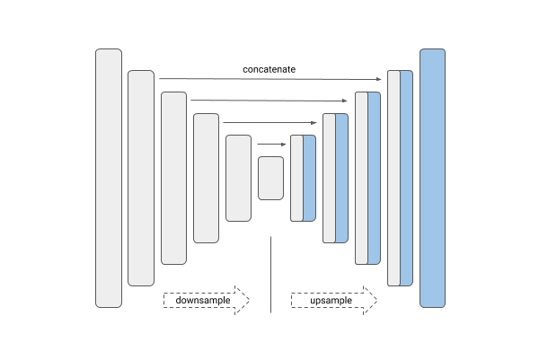

# AirBus Ship Segmentation
Customized implementation of the U-Net in Tensorflow for Kaggle's [Airbus Ship Detection Challenge](https://www.kaggle.com/competitions/airbus-ship-detection) from high definition images.

<p style="text-align:center; font-size:200%"> U-net architecture </p>
<p align="center">
  
</p>

**Note:** all U-net architectures (and the image above) were imported from `segmentation-models` repository - https://github.com/qubvel/segmentation_models

<br>

A few models based on U-net architecture were implemented:
- Baseline U-net model using 5 downsampling steps;  
Model type - `baseline`
- U-net model with VGG-19 CNN as a backbone;  
Model type - `vgg19`
- U-net model with ResNet-34 CNN as a backbone;  
Model type - `resnet34`
- U-net model with EfficientNetB5 as a backbone;  
Model type - `efficientnetb5`

**Hint:** to use certain architecture pass **model type** to `--model-type` parameter when run training or evaluation process.

<br>

## Quick start

1. Clone repository

2. Install dependencies
```bash
pip install -r requirements.txt
```
3. Download dataset from kaggle and unpack it to `data/` 
4. Download pretrained models from Google Drive - https://drive.google.com/file/d/1QMXfO4sdurHi1h3JZFump6gPAhjpmojw/view?usp=sharing
5. Add pretrained models to `models/` (Example : models/vgg19)
6. To run training process:
```bash
python train.py --image-path=data/train_v2 --label-path=data/train_ship_segmentations_v2.csv --use-empty=False --model-type=baseline --batch-size=32 --augmentation=True --aug-batch-size=16 --aug-iterations=3 --epochs=10 --learning-rate=0.001 --save-model-folder=train_baseline
```
7. To use pretrained model run:
```bash
python evaluate.py --image-path=data/test_v2 --prediction-folder-name=baseline_run_1 --batch-size=32 --model-type=baseline --model-path=models/baseline --threshold=0.5
```
<br>

## **Usage**
Note : Use Python 3.6 or newer

## Training

```console
> python train.py -h
usage: train.py [-h] [--image-path] [--label-path] [--use-empty] 
                [--model-type] [--batch-size] [--augmentation]
                [--aug-batch-size] [--aug-iterations] [--epochs] 
                [--learning-rate] [--save-model-folder]  

Train U-Net model on images

options:
  -h                    
                        show this help message and exit
  --image-path 
                        Folder with train images
  --label-path
                        Path to .csv file
  --use-empty
                        Either use images with no ship objects or not
  --model-type
                        Type of architecture: [baseline, vgg19, resnet34, efficientnetb5]
  --batch-size
                        Batch size
  --augmentation
                        Either apply data augmentation with ImageDataGenerator or not
  --aug-batch-size
                        Batch of ImageDataGenerator
  --aug-iterations
                        Number of generated augmented batches from the batch ImageDataGenerator was fitted
  --epochs        
                        Number of epochs
  --learning-rate
                        Learning rate
  --save-model-folder
                        Folder name to save fitted model; path - models/{--save-model-folder}
```

## Evaluate

```console
> python evaluate.py 
usage: evaluate.py [-h] [--image-path] [--prediction-path] [--batch-size]
                   [--model-type] [--model-path] [--threshold]

Predict masks with U-Net on images

options:
  -h                    show this help message and exit
  --image-path
                        Path to folder with train images
  --prediction-folder-name
                        Path to store predicted masks: data/prediction/...
  --batch-size
                        Batch size (to use memory in efficient way)
  --model-type
                        Type of architecture: [baseline, vgg19, resnet34, efficientnetb5]
  --model-path
                        Path to folder with model. Example - models/baseline
  --threshold
                        Threshhold for pixel binary classification
```

<br>

## Conclusions
1) To solve **Ships Segmentation task** a few CNN models with U-net architecture were implemented: `baseline` model, `VGG-19`, `ResNet34` and `EfficientNetB5`.  
2) Labels were encoded in (`start-run`) format, so they needed to be preprocessed to 2D masks 0 or 1 pixels value (not-ship and ship).  
3) The dataset of images was pretty large (bigger than memory size of computing machine) so it was necessary to implement `data generators` that scan images and pass them to model by batches.  
4) To make data more diverse, `ImageDataGenerator` was applied with some randoms `shifts` and `flips` to both original images and corresponding masks.  
5) For training process GPU P100 on kaggle platform was used to accelerate learning process,
6) Metrics: dice and IOU

Results of test subset on pretrained model in **data/prediction/**
